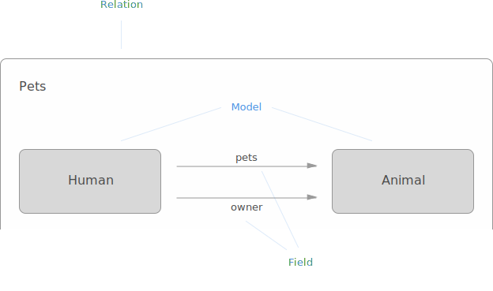
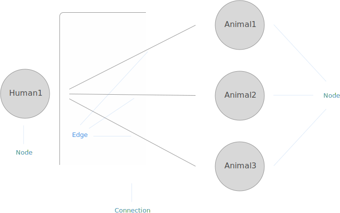

# Platform

This pages gives an explanation of the concepts which the Graphcool platform is based on. You don't have to read the sections in any particular order, so feel free to jump around.

## Architecture

* Endpoints
* Database
* Auth

## Data Model

### Model

A *model* defines the structure for a certain type of your data. (If you are familiar with SQL databases you can think of a model as the schema for a table.) A model consists of its name, an optional description and one or multiple [fields](#field).

An instantiation of a model is called a *node*. The collection of all nodes is what you would refer to as "your data". The term node makes a lot of sense here since every node is literally a node inside your data graph connected by edges.

> For example a specific user would be a node of the `User` model.

Every model will be available as a type in your GraphQL. A common notation to quickly describe a Model is the [GraphQL IDL](https://github.com/facebook/graphql/pull/90) (interface definition language).

> If your application is a blog where people can write posts and comment, you would probably need three models: `User`, `Post` and `Comment`. The IDL representation could look like this:

```graphql
type User {
  id: ID
  posts: [Post]
  comments: [Comment]
}

type Post {
  id: ID
  slug: String
  title: String
  text: String
  published: Boolean
  author: User
  comments: [Comment]
}

type Comment {
  id: ID
  text: String
  post: Post
  author: User
}
```

### Field

*Fields* are the building blocks of a [model](#model) giving a node its shape. Every field is referenced by its name and as has a type which is either a [scalar type](#scalar-type) or a [relation](#relation).

> A `User` model for example might have a `firstName` and an `email` field.

#### Scalar Types

##### String

A String holds text. This is the type you would use for a username, the content of a blog post or anything else that is best represented as text. String values are currently limited to 64KB.

##### Integer

An Integer is a number that cannot have decimals. Use this to store values such as the weight of an ingredient required for a recipe or the minimum age for an event.

##### Float

A Float is a number that can have decimals. Use this to store values such as the price of an item in a store or the result of complex calculations. (Note: We store Float values as Double inside our databases.)

##### Boolean

A Boolean can have the value `true` or `false`. This is useful to keep track of settings such as whether the user wants to receive an email newsletter or if a recipe is appropriate for vegetarians.

##### DateTime

The DateTime type can be used to store date or time values. A good example might be a person's date of birth. The used format for DateTime values is [ISO 8601](https://en.wikipedia.org/wiki/ISO_8601) and looks like this: `2015-11-22T13:57:31-03:00`.

##### Enum

Like a Boolean an Enum can have one of a predefined set of values. The difference is that you can define the possible values. For example you could specify how an article should be formatted by creating an Enum with the possible values `COMPACT`, `WIDE` and `COVER`.

##### JSON

Sometimes you need to store arbitrary JSON values like unstructured meta information. The JSON type makes sure that it is actually valid JSON and returns the value as a parsed JSON object/array instead of a string.

<!--
##### GeoPoint

*Coming soon...*
-->

##### ID

An ID value is a generated unique 25-character string based on [cuid](https://github.com/ericelliott/cuid). Fields with ID values are system fields and just used internally, therefore is not possible to create new fields with the ID type.

#### Required

Scalar fields can be marked as required (sometimes also referred to as "non-null"). When [creating a new node]() you need to supply a value for fields which are required and don't have a [default value](#default-value).

Required fields are usually marked using a `!` after the field type.

> An example for a required field on a `User` model could look like this: `email: String!`.


#### Default Value

You can set a default value for scalar fields. The value will be taken for new nodes when no value was supplied during creation.


#### Migration Value

A *migration value* is a field value which is applied to existing nodes. In case a model doesn't have any nodes yet, you cannot provide a migration value.

Migration values are not the same as default values and just exist temporarily in one of the following scenarios:

You have to provide a migration value when ...

* ... you create a new required field.
* ... you mark an existing non-required field as required.
* ... you change the type of a field.

You can provide a migration value but you don't have to when you create a new non-required field.

### Constraint

*Constraints* allow you to constrain the values of a field by certain characteristics. Values that don't fit the constraints cannot be saved and will be rejected as invalid.

#### Unique

Setting the *unique* constraint makes sure that two nodes can not have the same value for a certain field. The only exception is the `null` value, meaning that multiple nodes can have the value `null` without violating the constraint.

> A typical example is the `email` field on a `User` model.

Please note that only the first 191 characters in a String field are considered unique. Storing two different strings is not possible if the first 191 characters are the same.


### System Artifacts

In order to make the platform as seamless and integrated as possible, we introduced some predefined artifacts in each project. These artifacts are designed to be as minimal as possible and cannot be deleted. At the moment there are two type of artifacts: *system models* and *system fields*.

#### `User` Model

Every project has a system model called `User`. As the `User` model is the foundation for our [built-in authentication system](#authentication) you cannot delete it. But of course you can still extend the `User` model to suit your needs and it behaves like every other model.

Additional to the predefined [`id` field](#id-field), the `User` model also has a system field called `roles` which is needed for [role-based permissions](#authenticated).

#### `id` Field

Every model has a system field with the name `id` of type [ID](#id). The `id` value of every node (regardless the model) is globally unique and unambiguously identifies a node ([as required by Relay](https://facebook.github.io/relay/docs/graphql-object-identification.html)).

### Permission

Each field has a set of associated *permissions* which are used to restrict read and write access to the underlying field values of nodes. This lets you define a powerful system of rules combining the idea of role based access control ([RBAC](https://en.wikipedia.org/wiki/Role-based_access_control)) with node level access control.

Each permission is described by a selection of one or many possible operations and a permission level.

#### Operation

An *operation* in the context of permissions is either enabled or disabled and can be one of the following:

* Read: Somebody should be allowed to read the value of a specific field
* Create: Somebody should be allowed to create a new node and set this value
* Update: Somebody should be allowed to update the value of an existing node
* Delete: Somebody should be allowed to

**TODO: On hold due to permission discussion**

#### Permission Level (Guest, Authenticated, Related)

### Relation

A *relation* defines how two models are related to each other. Every relation has a name and connects two models via a field in each direction. A relation can either be a one-to-one, a one-to-many or a many-to-many relation.

> A simple example for a relation could be a `Pet` relation where a `Human` model is related to a `Animal` model. Starting from a `Human` node you can access the related `Animal` nodes via the `pets` field and using the `owner` field for the other direction.





#### Connection & Edges

## Security

### Authentication

#### Sessions

#### System Tokens

<!--
## File Management

*Coming soon...*
-->

## Actions

* Debugging

<!--
## Integrations

*Coming soon...*

-->
