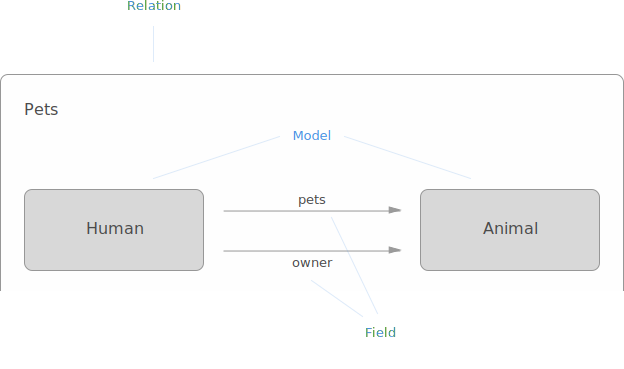
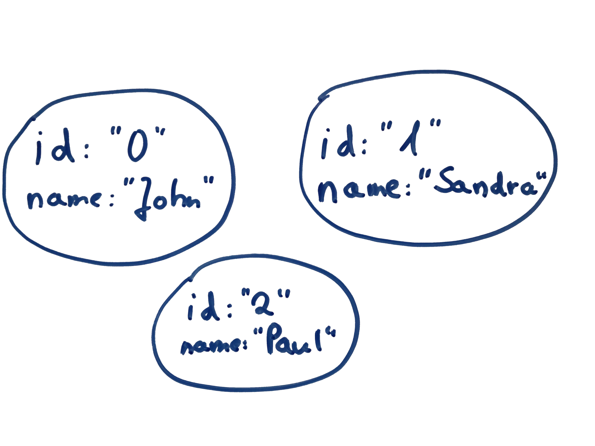
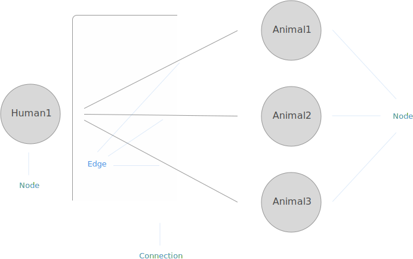

# Platform

This page explains the terminology and concepts used within the Graphcool platform.

You don't have to read the sections in any particular order, so feel free to jump around.

## Project

To customize one of your projects, you can:
* modify your [Data Schema](#data-schema) by creating or modifying [models](#model) or [relations](#relation)
* modify [Permissions](#permission) for data access to enrich the built-in [authentication system](#authentication)
* modify [Actions](#actions) to handle your business logic

### Playground

The available queries and mutations for your project are automatically generated from your data schema and can be explored in the Playground accessible from inside your personal Dashboard.

See [this tutorial](https://egghead.io/lessons/javascript-using-graphql-s-graphiql-tool) on how to effectively use the GraphiQL Playground.

### Endpoint

To read or modify data from inside your app, you can make use of the [Simple API](simple-api) or the [Relay API](relay-api).
You can send requests to their respective endpoints that look like this:

``https://api.graph.cool/simple/v1/__PROJECT_ID__``
``https://api.graph.cool/relay/v1/__PROJECT_ID__``

Note: You can copy your endpoint from within the Dashboard after you logged in.

## Data Schema

Every project has its own *data schema*.
You can organize your data in [models](#model) and define [relations](#relation) between them.



### Model

A *model* defines the structure for a certain type of your data. (If you are familiar with SQL databases you can think of a model as the schema for a table.) A model has a name, an optional description and one or multiple [fields](#field).

An instantiation of a model is called a *node*. The collection of all nodes is what you would refer to as "your data". The term node refers to a node inside your data graph.

> For example, the users John, Sandra and Paul are three different nodes of the `User` model.



Every model will be available as a type in your GraphQL schema. A common notation to quickly describe a Model is the [GraphQL IDL](https://github.com/facebook/graphql/pull/90) (interface definition language).

> If your application is a blog where people can write posts and comment, you could define three models: `User`, `Post` and `Comment`. The IDL representation could look like this:

```graphql
type User {
  id: ID
  name: String
  posts: [Post]
  comments: [Comment]
}

type Post {
  id: ID
  slug: String
  title: String
  text: String
  published: Boolean
  author: User
  comments: [Comment]
}

type Comment {
  id: ID
  text: String
  post: Post
  author: User
}
```

### Field

*Fields* are the building blocks of a [model](#model) giving a node its shape. Every field is referenced by its name and has a type which is either a [scalar type](#scalar-types) or a [relation](#relation).

> The `Post` model from above has a `title` and an `text` field.

#### Scalar Types

##### String

A String holds text. This is the type you would use for a username, the content of a blog post or anything else that is best represented as text.

Note: String values are currently limited to 64KB in size.

##### Integer

An Integer is a number that cannot have decimals. Use this to store values such as the weight of an ingredient required for a recipe or the minimum age for an event.

Note: Int values range from -2147483648 to 2147483647.

##### Float

A Float is a number that can have decimals. Use this to store values such as the price of an item in a store or the result of complex calculations.

Note: We store Float values as Double inside our databases.

Note: Float value can have 65 digits in total, of which at most 35 can be in front of the decimal point, and 30 behind the decimal point.

##### Boolean

A Boolean can have the value `true` or `false`. This is useful to keep track of settings such as whether the user wants to receive an email newsletter or if a recipe is appropriate for vegetarians.

##### DateTime

The DateTime type can be used to store date or time values. A good example might be a person's date of birth. The used format for DateTime values is [ISO 8601](https://en.wikipedia.org/wiki/ISO_8601) and looks like this: `2015-11-22T13:57:31-03:00`.

##### Enum

Like a Boolean an Enum can have one of a predefined set of values. The difference is that you can define the possible values. For example you could specify how an article should be formatted by creating an Enum with the possible values `COMPACT`, `WIDE` and `COVER`.

Note: Enum values can at most be 191 characters long.

##### JSON

Sometimes you need to store arbitrary JSON values like unstructured meta information. The JSON type makes sure that it is actually valid JSON and returns the value as a parsed JSON object/array instead of a string.

Note: JSON values are currently limited to 64KB in size.

<!--
##### GeoPoint

*Coming soon...*
-->

##### ID

An ID value is a generated unique 25-character string based on [cuid](https://github.com/ericelliott/cuid). Fields with ID values are system fields and just used internally, therefore is not possible to create new fields with the ID type.

#### Type Modifiers

##### List

Scalar fields can be marked with the list field type. A field of a relation that has the many multiplicity will also be marked as a list.

Note: List values are currently limited to 64KB in size, independently of the [scalar type](#scalar-types) of the field.

##### Unique

Setting the *unique* constraint makes sure that two nodes can not have the same value for a certain field. The only exception is the `null` value, meaning that multiple nodes can have the value `null` without violating the constraint.

> A typical example is the `email` field on the `User` model.

Please note that only the first 191 characters in a String field are considered unique. Storing two different strings is not possible if the first 191 characters are the same.

##### Required

Scalar fields can be marked as required (sometimes also referred to as "non-null"). When creating a new node, you need to supply a value for fields which are required and don't have a [default value](#default-value).

Required fields are usually marked using a `!` after the field type.

> An example for a required field on the `User` model could look like this: `name: String!`.

##### Default Value

You can set a default value for scalar fields. The value will be taken for new nodes when no value was supplied during creation.

#### Migrating nodes

When working with fields, you might be prompted to set a *migration value*.

A migration value is a field value which is applied to existing nodes. In case a model doesn't have any nodes yet, you do not have to provide a migration value.

Migration values are not the same as default values and just exist temporarily in one of the following scenarios:

You have to provide a migration value when you
* create a new required field.
* mark an existing non-required field as required.
* change the type of a field.

You can provide a migration value when you create a new non-required field, but you don't have to.

### Relation

A *relation* defines how two models are related to each other. Every relation has a name and connects two models via a field in each direction. A relation can either be a one-to-one, a one-to-many or a many-to-many relation.

> A simple example for a relation could be the `Pet` relation where the `Human` model is related to the `Animal` model. Starting from a `Human` node you can access the related `Animal` nodes via the `pets` field and using the `owner` field for the other direction.



Note: A model can be related to itself.

#### Connection & Edges

A relation can only exist between two models. Two nodes that are related to each other are connected by an *edge*. All edges belonging to the same relation together form a *connection*.

Note: Two nodes can only be connected once for each relation between the according two models.

### System Artifacts

In order to make the platform as seamless and integrated as possible, we introduced some predefined artifacts in each project. These artifacts are designed to be as minimal as possible and cannot be deleted. At the moment there are two type of artifacts: *system models* and *system fields*.

#### `User` Model

Every project has a system model called `User`. As the `User` model is the foundation for our [built-in authentication system](#authentication) you cannot delete it. But of course you can still extend the `User` model to suit your needs and it behaves like every other model.

Additional to the predefined [`id` field](#id-field), the `User` model also has a system field called `roles` which is needed for [role-based permissions](#authenticated).

#### `id` Field

Every model has a system field with the name `id` of type [ID](#id). The `id` value of every node (regardless the model) is globally unique and unambiguously identifies a node ([as required by Relay](https://facebook.github.io/relay/docs/graphql-object-identification.html)).

## Authentication

Request authentication is handled using *authentication tokens* which grant role-based access to the data of your project.

They have to be supplied using the `Authorization` header of your http requests:

```plain
Authorization: Bearer <authentication token>
```

If a request to your endpoint contains a valid authentication token, it is granted certain [permissions](#permission) that you can configure on a field granularity.

### Temporary Authentication Token

The User model has the special `signInUser` mutation to support sign-in using email and password. If it is successful it will grant a *temporary authentication token* that uniquely identifies the user signing in and has an expiration duration of 30 days.

Read more about the `signInUser` mutation in the [Simple API](simple-api#sign-in) and in the [Relay API](relay-api#sign-in).

#### Session User

A user is considered to be signed in during a request, if the user is identified by the authentication token supplied to the request.

If an invalid authentication token is supplied to a request, the request is granted


### Permanent Authentication Token

You can create *permanent authentication tokens* in the Dashboard for server-side services that need access to your data.

Note: Be **very** careful where you use the permanent authentication tokens. Everyone with a permanent authentication token can do serious harm to your data, so you should never include them anywhere client-side, like on a website or a mobile app.

## Permission

Each field has a set of associated *permissions* which are used to restrict read and write access to the underlying field values of nodes. This lets you define a powerful system of rules combining the idea of role based access control ([RBAC](https://en.wikipedia.org/wiki/Role-based_access_control)) with node level access control.

Each permission is described by a selection of one or many possible operations and a permission level.

Whenever someone is requesting to read or modify a field, this request is checked against existing permissions. The request will only be allowed, if there is a permission for the field in question that matches the request.

A permission consists of an *operation* and a *permission level*.

### Operation

An operation in the context of permissions is either enabled or disabled and can be one of the following:

* Read: Somebody should be allowed to read the value of a specific field
* Create: Somebody should be allowed to create a new node and set this value
* Update: Somebody should be allowed to update the value of an existing node
* Delete: Somebody should be allowed to delete an existing node

### Permission Level

A permission level describes the required minimum access level the user needs to successfully to perform a certain operation.

There are two permission levels:

* A user that is not authenticated is granted `GUEST` level access.
* An [authenticated session user](#session-user) is granted `GUEST` and `AUTHENTICATED` level access.

<!--
## File Management

*Coming soon...*
-->

## Actions

Actions are a simple yet powerful concept to handle your custom business logic workflow.

An action consists of a *trigger* and a *handler*. Whenever an operation triggers the action, a custom *payload* is sent to the handler.

### Trigger

An action trigger is the combination of a model and a write operation.
Whenever this write operation is executed on the model, the action will be triggered.

> For example, if you want to trigger an action on the `User` model, the following triggers are available:
* a new user is created
* an existing user is updated
* an existing user is deleted

### Handler

An action handler is defined by an url. A post request containing the action payload  is sent to this url whenever the action is triggered.

You can use [Webtask](https://webtask.io/) or [AWS Lambda](http://docs.aws.amazon.com/lambda/latest/dg/welcome.html) as action handlers as a recommended choice.

Of course you can also enter an url pointing to a server that you are running yourself.

### Payload

Every action has a payload, that is sent to the handler when the action is triggered. You can define the payload with a GraphQL query on the node that is either created, updated or deleted.

> Imagine you want to send a newsletter whenever you update one of your posts. Then you could include the post's slug and title like this:

```graphql
{
  updatedNode {
    id
    slug
    title
  }
}
```

As always, you can explore the available schema in the embedded GraphiQL instance when creating an action payload.


<!--
## Integrations

*Coming soon...*

-->
